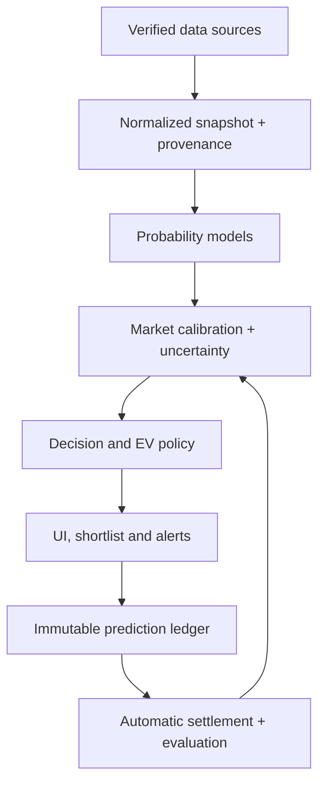

# Sporty-Rabbi / Agent 47 Hardening Directive

**To:** VS Code Copilot coding agent  
**From:** Code-review and model-design partner  
**Repository:** `Azprojects-tech/Sporty-Rabbi`  
**Reviewed branch:** `main`  
**Reviewed head:** `04a885d09c0180f6a45b7013acf1cdde1fdf3f4c`  
**Head message:** `feat: separate signal strength from 1X2 outcome probability in API and UI`  
**Review date:** 18 July 2026

## 1. How to use this directive

Treat this document as the master technical specification for hardening Sporty-Rabbi. Do **not** attempt to implement the entire document in one generation or one commit.

Work in this order:

1. Re-read the affected files at the current branch head before editing.
2. Implement only the phase explicitly requested by the user.
3. Keep each phase small, reviewable and reversible.
4. Add tests before or with each logic change.
5. Run the full verification commands listed in this document.
6. Report changed files, behavior changes, test results and remaining risks.
7. Stop after the requested phase and wait for review.

Do not silently rewrite the whole application. Preserve unrelated UI and deployment behavior. Never push directly to `main`; use a branch and reviewable commits when publishing is requested.

## 2. Product truth

Sporty-Rabbi is intended to become three connected systems:

1. **Prediction brain:** estimate football market probabilities, with an initial emphasis on goals markets and genuinely high-scoring opportunities.
2. **Decision assistant:** scan daily fixtures and live games, then return a disciplined state: `BET`, `NO_BET`, `WATCH_LIVE` or `NEEDS_PRICE`.
3. **Evidence and delivery platform:** record every forward prediction, settle it automatically, measure performance, deliver valid alerts through WhatsApp and eventually expose verified sports intelligence to subscribers.

The user currently pays for API-Football, Railway, VS Code Copilot and ChatGPT Plus. Do not introduce another paid dependency while the system is unprofitable. Use the existing sports API, Firestore, manual odds entry and deterministic calculations first.

The user is fully aware that betting is risky. Nevertheless, the software must not promise daily income, chase a daily profit target, increase stakes after losses or describe unvalidated output as near-certain. No model can make football betting “bulletproof.” The engineering goal is a system that is **fail-closed, auditable, calibrated, testable and resistant to fabricated data**.

## 3. Desired behavior

The final Agent 47 contract is:

- Goals markets are the first priority, especially `OVER_1_5`, `OVER_2_5`, `OVER_3_5`, `BTTS_YES` and live “another goal” markets.
- Win markets remain supported when the data justify them.
- A high-scoring league is a prior, not a guarantee.
- Live evidence must confirm, weaken or overturn the pre-match prior.
- An analysis result and a betting decision are different objects.
- A strong probability without a usable bookmaker price is not yet a bet.
- `NO_BET` is a decision state, never a selectable market.
- `WATCH_LIVE` means the pre-match setup is promising but needs specified live confirmation.
- `NEEDS_PRICE` means the model is strong but no current bookmaker odds were supplied.
- An “80% pick” means a calibrated probability for one exact market, not the 15-parameter composite score.
- Every recommendation must show its market, probability, uncertainty, evidence quality, fair odds, minimum acceptable odds, offered odds if known, expected value if known, decision and reason codes.
- WhatsApp must work without the user opening a match panel.
- Every issued prediction must later be settled automatically.

## 4. Current-state verdict at commit `04a885d`

The latest commit is a useful presentation improvement. It introduces `decisionMetrics` and changes the UI label from “Model” to “Signal,” separating the composite score from the displayed 1X2 probability. That is directionally correct.

It is not yet an operating-logic fix. Calibration, premium selection, bet slips and alerts still use `match.confidence`, which is assigned from `analysis.overallScore`. The new fields are mostly display metadata and do not govern execution.

The current repository is a substantial prototype, not decorative code. It has a real React/Vite frontend, Node/Express backend, API-Football integration, Firebase persistence, Twilio integration, a 15-parameter Agent 47 engine and a Dixon-Coles-style Poisson layer. However, several partially connected subsystems still disagree about the meaning of confidence, markets, live data and executable decisions.

### Verification performed on the reviewed head

- Frontend production build: passed.
- JavaScript syntax checks for backend/shared/scripts: passed.
- Backend “build”: only prints `Backend ready`; it does not compile or test backend code.
- Frontend lint: failed because `eslint` is referenced but not installed.
- Automated tests: none found.
- Empty-input runtime test returned `NO_BET`, which is good, but also returned quality 68 and coverage 0.60 from mostly default data, which is too generous.
- The new `decisionMetrics` returned 1X2 as available with `0/0/0` probabilities when Poisson data were absent. This is a new correctness bug caused by `Number(null) === 0`.

## 5. Critical defects to fix before trusting automatic slips or alerts

### 5.1 `NO_BET` is not obeyed downstream

In `backend/src/services/agent47Service.js`, the engine can correctly return:

```js
{ type: 'NO_BET', selection: 'No Bet', ... }
```

But `backend/src/server.js` still:

- assigns `confidence = analysisObj.overallScore` in live analysis;
- assigns `confidence: analysis.overallScore` during calibration;
- builds `highConfidence` from that match-level composite;
- filters slip candidates using `m.confidence`;
- lets `bestSelection()` return the first recommendation even when it is `NO_BET`;
- lets `oddsForSelection()` fall through to fake default odds `1.5` for unknown types;
- sends calibration alerts based on the composite even when the top recommendation is `NO_BET`.

Result: the brain may say “No Bet” while the rest of the application can still shortlist, price, stake or alert it.

### 5.2 Confidence still has multiple incompatible meanings

Current code uses “confidence” to mean several different things:

- the weighted 15-parameter signal score;
- a Poisson probability;
- a heuristic recommendation score;
- a live momentum score;
- an LLM-generated narrative confidence;
- a slip filter and staking input;
- an alert threshold.

These must be separated. A percentage shown to the user must identify what event it measures.

### 5.3 The latest `decisionMetrics` null check is wrong

Current code effectively does:

```js
Number.isFinite(Number(probs.homeWin))
```

When `probs.homeWin` is `null`, `Number(null)` is `0`, so the API reports 1X2 as available with zero probabilities. Replace this with a null-safe parser:

```js
export function finiteNumberOrNull(value) {
  if (value === null || value === undefined || value === '') return null;
  const n = Number(value);
  return Number.isFinite(n) ? n : null;
}
```

Then require all three values and validate that their sum is approximately 100 before `available: true`.

### 5.4 Market identifiers are incompatible

Agent 47 currently emits broad types such as:

- `GOALS_ONLY`
- `WINS_ONLY`
- `NEXT_GOAL`
- `SNIPER_WATCH`
- `NO_BET`

The slip code expects identifiers such as:

- `home_win`
- `away_win`
- `over25`
- `btts`
- `draw`

Most recommendations therefore fall through to default odds `1.5`. This makes combined odds, projected returns and projected profits untrustworthy.

### 5.5 There is no real execution EV gate

`recommendationEVSanity()` is a set of heuristic penalties. It is not expected-value calculation. The actual `/api/bet-value` endpoint computes `probability × odds − 1`, but it is disconnected from recommendations, calibration and slips.

The system must never fabricate offered odds from its own probability. Fair odds are useful for comparison, but they are not bookmaker odds and must not be used as if a bookmaker offered them.

### 5.6 Live xG is mathematically inconsistent across routes

There are multiple live analysis paths with different transformations.

- `phaseBlendCountStat()` is documented as returning a per-90 value, but in the late phase it returns the raw cumulative live count.
- The main `/api/analyze` late path assigns observed home live xG to both `homeXgAvg` and `awayXgaAvg`. `runPoisson()` then combines those related values and can produce an xG-squared effect.
- The live slow path passes observed cumulative xG directly as full-match attacking and defensive averages.
- The slow path passes `cards: match.cards`, while Agent 47 expects `homeCards` and `awayCards`.
- Several routes calculate their own live projections rather than using one shared live engine.

Observed cumulative xG is evidence about the current match. It is not simultaneously the team’s full-match attack rate and the opponent’s season defensive rate.

### 5.7 “Next goal” is mislabeled in `liveAnalyticsService.js`

The current function calculates each team’s probability of scoring at least once before full time. Those two numbers are not a mutually exclusive next-goal distribution and can sum above 100.

The correct distribution is:

```js
const total = lambdaHomeRemaining + lambdaAwayRemaining;
const noMoreGoal = Math.exp(-total);
const anyGoal = 1 - noMoreGoal;
const homeNext = total > 0 ? (lambdaHomeRemaining / total) * anyGoal : 0;
const awayNext = total > 0 ? (lambdaAwayRemaining / total) * anyGoal : 0;
```

`homeNext + awayNext + noMoreGoal` must equal 1 within floating-point tolerance.

### 5.8 Live alerting is not truly automatic

`pollLiveMatches()` fetches, analyses, caches and broadcasts live matches. It does not call the live alert evaluator.

`generateBettingAlert()` is called inside `GET /api/live-analysis/:matchId`. That endpoint is normally requested when the live analysis panel is open. Therefore a user working a 9-to-5 job may receive no trigger because nobody requested the endpoint.

The endpoint also has two related bugs:

- `calculateNextGoalProbability()` accepts only status `LIVE`, while API-Football commonly uses `1H`, `2H`, `HT`, `ET` and similar statuses.
- alert objects normally carry `probability`, but server code reads `alert.confidence || match.confidence`, allowing an unrelated composite score to become the alert probability.

### 5.9 Twilio configuration names disagree

`README.md` documents `TWILIO_WHATSAPP_TO`, while `notificationService.js` reads `ALERT_PHONE_NUMBER`. The system documentation and code also differ. Choose one canonical variable and temporarily support the old alias:

```js
const toRaw = process.env.TWILIO_WHATSAPP_TO || process.env.ALERT_PHONE_NUMBER || '';
```

Do not log the full destination number. Add a status endpoint that reports booleans and missing variable names, not secrets.

### 5.10 Data coverage counts defaults as evidence

`paramCoverage` is calculated from non-null parameter scores. Many parameter functions create apparently strong scores from fallback values even when no real match data were supplied. In an empty-input test, “Star Power 90,” “Pace 88,” “Crisis Stable 70” and “Lifecycle 63” appeared from defaults.

Defaults may be useful priors, but they must not count as observed coverage. Unknown evidence cannot strengthen a financial decision.

### 5.11 League knowledge is static and misses the user’s focus competitions

The current hard-coded league averages and reliability scalars include major European competitions, MLS and several other leagues, but do not provide a proper current-season model for Iceland, Sweden, Finland, Norway, Denmark or Australia. Unknown leagues fall back to generic values.

Do not simply label all Nordic/Australian games as high scoring. Build evidence-based competition-season profiles with sample size and shrinkage toward a global prior.

### 5.12 Calibration measures but does not learn or halt

The code calculates Brier score, log loss, confidence gaps, ROI and CLV summaries from manually settled bets. It also writes forward prediction documents with `outcome: null` and `settledAt: null`.

No automatic prediction settlement flow was found. `calibrationHealth.halt` is logged but not enforced. Model probabilities and weights are not refitted from outcomes.

Also, Brier/log loss are currently calculated from a generic `confidence` field rather than an exact market probability. That is not statistically meaningful when different markets and signal scores are mixed together.

### 5.13 LLM numeric hallucination remains an input risk

`geminiService.js` still tells an ungrounded model to:

- use its best knowledge for form, xG, players and league position;
- use a reasonable league-average estimate when unsure;
- estimate live minute;
- produce realistic current-season stats when Gemini grounding fails;
- use a hard-coded “May 2026” date.

These numbers can enter the financial model. Remove this behavior. An LLM may structure confirmed facts or write a narrative from supplied metrics. It must never invent odds, scores, minutes, form, xG, injuries, standings or fixtures.

### 5.14 Bet-slip risk logic is unsafe

Current slip generation can allocate a very large percentage of bankroll, forces fallback candidates when threshold-qualified candidates do not exist and builds accumulators without an EV gate. Comments describe “near-certain” singles and a realistic daily profit expectation that the code has not proven.

The code hard-codes a ₦250,000 bankroll while the user’s current stated bankroll is ₦500,000. Bankroll should be configuration or user state, not a source-code constant. More importantly, the daily ₦100,000 target must never cause higher stakes or weaker selections.

## 6. Target architecture

All decisions should pass through one pipeline:



The LLM is outside the numeric path. It may consume the normalized/model output and produce explanatory text, but its output must not modify probabilities, data quality, decisions, odds or stakes.

## 7. Canonical domain contract

Create `shared/marketKeys.js` and `shared/decisionStates.js`. Stop parsing free-text selections to determine what market a recommendation represents.

Suggested market keys:

```js
export const MARKET = Object.freeze({
  HOME_WIN: 'HOME_WIN',
  DRAW: 'DRAW',
  AWAY_WIN: 'AWAY_WIN',
  OVER_1_5: 'OVER_1_5',
  OVER_2_5: 'OVER_2_5',
  OVER_3_5: 'OVER_3_5',
  UNDER_2_5: 'UNDER_2_5',
  BTTS_YES: 'BTTS_YES',
  NEXT_GOAL_HOME: 'NEXT_GOAL_HOME',
  NEXT_GOAL_AWAY: 'NEXT_GOAL_AWAY',
  NO_MORE_GOAL: 'NO_MORE_GOAL',
});

export const DECISION = Object.freeze({
  BET: 'BET',
  NO_BET: 'NO_BET',
  WATCH_LIVE: 'WATCH_LIVE',
  NEEDS_PRICE: 'NEEDS_PRICE',
});
```

Each market candidate should have a stable schema similar to:

```js
{
  marketKey: 'OVER_2_5',
  label: 'Over 2.5 Goals',
  phase: 'PRE_MATCH',
  rawModelProbability: 0.64,
  calibratedProbability: 0.60,
  probabilityInterval: { low: 0.54, high: 0.66 },
  signalStrength: 74,
  dataQuality: { score: 82, observedCoverage: 0.81 },
  fairOdds: 1.67,
  minimumAcceptableOdds: 1.94,
  offeredOdds: null,
  marketImpliedProbability: null,
  edge: null,
  expectedValue: null,
  decision: 'NEEDS_PRICE',
  reasonCodes: ['HIGH_GOAL_BASELINE', 'PRICE_MISSING'],
  explanation: '...',
}
```

Rules:

- Probabilities use `0..1` internally. Convert to percentages only at the API/UI edge.
- `signalStrength` is not used as probability.
- `NO_BET` has no `marketKey`, no odds and no stake.
- `WATCH_LIVE` includes explicit confirmation conditions, such as “after 20 minutes, combined xG ≥ 0.70 and rolling shots-on-target delta ≥ 3.”
- `NEEDS_PRICE` includes fair odds and minimum acceptable odds.
- A `BET` requires a known offered price, positive conservative EV, sufficient data quality and no safety veto.

## 8. Decision and value engine

Create one pure module, for example `backend/src/services/valueEngine.js`.

For a candidate:

```js
function evaluateValue({ calibratedProbability, probabilityLow, offeredOdds, minEv = 0.05 }) {
  const p = probabilityLow ?? calibratedProbability;
  if (!(p > 0 && p < 1)) return { decision: 'NO_BET', reason: 'INVALID_PROBABILITY' };

  const fairOdds = 1 / calibratedProbability;
  const minimumAcceptableOdds = (1 + minEv) / p;

  if (!(offeredOdds > 1)) {
    return { decision: 'NEEDS_PRICE', fairOdds, minimumAcceptableOdds };
  }

  const expectedValue = p * offeredOdds - 1;
  return {
    decision: expectedValue >= minEv ? 'BET' : 'NO_BET',
    fairOdds,
    minimumAcceptableOdds,
    expectedValue,
  };
}
```

Use the conservative lower probability bound for execution. This creates a margin of safety against model uncertainty.

When a complete bookmaker market is available, remove the margin before comparing the model with the market:

```js
const raw = odds.map(o => 1 / o);
const overround = raw.reduce((sum, p) => sum + p, 0);
const noVig = raw.map(p => p / overround);
```

Do not de-vig a single isolated price because the market overround cannot be identified from one side alone.

### Odds without another subscription

Implement an `OddsProvider` interface with provenance and timestamps. Initial sources:

1. **Existing API-Football plan:** first check whether the current paid plan already permits the provider’s odds endpoint. This is not a request to upgrade the plan.
2. **Manual odds entry:** allow the user to enter the current price for a shortlisted market. Recalculate EV instantly.
3. **Minimum acceptable odds:** when no price is available, show the threshold the user should compare against the bookmaker.

Do not scrape bookmakers in a fragile or terms-violating way. Do not ask an LLM to estimate odds. Do not substitute fair odds for offered odds.

## 9. Model redesign: goals first, evidence first

### 9.1 Competition-season goal profiles

Create a persisted profile keyed by `leagueId + season`, for example:

```js
{
  leagueId,
  season,
  sampleSize,
  homeGoalsPerMatch,
  awayGoalsPerMatch,
  totalGoalsPerMatch,
  over15Rate,
  over25Rate,
  over35Rate,
  bttsRate,
  zeroZeroRate,
  goalVariance,
  lastUpdatedAt,
  source: 'api-football-results'
}
```

Build these profiles from completed fixtures already available through the existing API plan, cached and persisted so they are not fetched repeatedly. If historical backfill is not permitted by the current plan, accumulate the profiles prospectively from fixtures Sporty-Rabbi already observes.

Use hierarchical shrinkage so a five-match league sample cannot dominate:

```js
function shrink(empirical, sampleSize, globalPrior, priorMatches = 40) {
  return (sampleSize * empirical + priorMatches * globalPrior) / (sampleSize + priorMatches);
}
```

This is how Icelandic, Norwegian, Swedish, Finnish, Danish and Australian competitions should enter the model. Their profile can raise a goals prior when the current season actually supports it, while the `zeroZeroRate` and uncertainty prevent “Nordic always scores” reasoning.

### 9.2 Team attack and defence strengths

For each team and competition-season, calculate:

- home and away attacking rate;
- home and away defensive concession rate;
- exponentially weighted recent form;
- xG/xGA where genuinely supplied;
- goals/shots proxies where xG is unavailable, with lower provenance quality;
- opponent-strength adjustment;
- sample size and uncertainty.

The basic pre-match means should be structurally similar to:

```js
lambdaHome = leagueHomeGoalRate * homeAttackStrength * awayDefenceWeakness;
lambdaAway = leagueAwayGoalRate * awayAttackStrength * homeDefenceWeakness;
```

Estimate home advantage inside these lambdas. Do not leave home advantage only as a three-percent composite parameter that never changes 1X2 probabilities.

Keep the Dixon-Coles correction for low scores, but validate and normalize the complete score matrix. Return raw probabilities without applying motivation or signal-quality boosts to them. Heuristics can affect uncertainty or decision vetoes, but must not silently convert a 66% model probability into a 73% “probability.”

### 9.3 Separate probability from decision confidence

Return at least:

- `rawModelProbability`;
- `calibratedProbability`;
- `probabilityInterval` or uncertainty score;
- `signalStrength`;
- `dataQuality`;
- `decision`;
- `expectedValue` when price exists.

Do not create one master percentage by averaging parameters with opposite meanings. Vulnerability, motivation, stability, market divergence and Over 2.5 probability are useful features but not one common probability scale.

### 9.4 High-scoring-game detector

The high-scoring detector should rank exact markets, not just matches. Suggested inputs:

- competition-season scoring prior;
- team attack and defence rates;
- recent weighted goals/xG;
- combined `zeroZeroRate` and clean-sheet rates;
- Over 1.5/2.5/3.5 and BTTS probabilities from the score matrix;
- injuries/lineups only when confirmed;
- fixture stage and motivation as uncertainty/context features;
- data coverage and freshness.

Output separate probabilities for Over 1.5, Over 2.5, Over 3.5 and BTTS. A match can be a strong Over 1.5 candidate but a poor Over 3.5 price.

## 10. One live model, not several route-specific models

Create a shared module such as `backend/src/services/liveModelService.js`. All poll, click-analysis and alert routes must call it.

Inputs:

- pre-match lambdas and their provenance;
- current score and minute;
- cumulative live xG, shots, shots on target, possession, attacks and cards when available;
- previous stored live snapshots;
- competition profile;
- confirmed substitutions/lineups if the provider supplies them.

Outputs:

- remaining home and away lambdas;
- probability of at least one, two and three more goals;
- coherent next-goal distribution;
- live final 1X2 distribution based on current score plus remaining-goal matrix;
- market candidates and reason codes;
- data quality and freshness.

Persist a lightweight snapshot per fixture every poll. Calculate recent pressure from deltas over the last 5–10 minutes rather than cumulative match totals. If the provider only supplies cumulative values, derive deltas from successive snapshots.

Do not extrapolate early xG without shrinkage. A simple first implementation may use:

```js
liveRatePer90 = accumulatedXg * 90 / Math.max(minute, 1);
updatedRate = priorWeight * preMatchRate + liveWeight * liveRatePer90;
remainingLambda = updatedRate * remainingMinutes / 90;
```

Make weights phase-aware and cap them using research-backed, testable constants. Do not return cumulative late xG from a function documented as a per-90 rate.

Red-card adjustments must be two-sided and minute-aware: reduce the carded team’s attack and raise the opponent’s attacking opportunity. Store the multiplier values in one configuration module and test both home-red and away-red cases.

## 11. Data provenance and fail-closed coverage

Add a provenance map to the normalized input rather than allowing silent defaults:

```js
dataProvenance: {
  homeXgAvg: { source: 'api-football-team-stats', observed: true, asOf: '...' },
  awayXgAvg: { source: 'league-prior', observed: false, asOf: '...' },
  oddsOver25: { source: 'manual', observed: true, asOf: '...' }
}
```

Recommended source tiers:

- `VERIFIED_LIVE`
- `VERIFIED_SEASON`
- `SEARCH_GROUNDED_FACT`
- `HISTORICAL_PRIOR`
- `DEFAULT_PRIOR`
- `UNKNOWN`

Only verified observations and sufficiently supported historical profiles count toward `observedCoverage`. Priors may enable a probability estimate but must widen uncertainty. Unknown inputs should produce `null` feature scores where practical, not confident neutral or positive scores.

Every recommendation must carry:

- input timestamp;
- source freshness;
- observed coverage;
- prior coverage;
- missing critical fields;
- model version.

If critical fields are stale or missing, return `WATCH_LIVE` or `NO_BET` instead of lowering an opaque confidence score by a few points.

## 12. Daily calibration scanner redesign

The “Calibrate” action should become a daily decision run, not a claim that the model has statistically calibrated itself.

For each fixture:

1. Fetch verified fixture identity and kickoff time.
2. Enrich from existing API sources within quota.
3. Normalize values and provenance.
4. Generate raw probabilities.
5. Apply the correct stored calibration model for market/league/phase if a sufficient sample exists.
6. Calculate uncertainty and data quality.
7. Evaluate the current price if available.
8. Assign one decision state.
9. Persist the immutable prediction snapshot.

Return four buckets:

- `BET_READY`: price known, conservative EV positive, quality gates passed;
- `NEEDS_PRICE`: strong model candidate but no offered price;
- `WATCH_LIVE`: specified live confirmation required;
- `NO_BET`: weak, conflicting, overpriced or insufficient data.

Rename the existing high-confidence list:

- If odds and EV exist: `80%+ Bet-Ready` may be used only for calibrated market probabilities at or above 0.80.
- Without odds: call it `80%+ Model Candidates — Price Required`.

Never populate the bucket from `overallScore`.

## 13. Automatic WhatsApp design

Alert evaluation belongs in the background live poll, not in a read-only GET endpoint.

After fresh matches are processed in `pollLiveMatches()`:

```js
await evaluateLiveAlertCandidates(processedMatches, previousSnapshots);
```

The evaluator should:

1. Normalize all supported live statuses.
2. Call the shared live model.
3. Create candidates from exact markets.
4. Exclude `NO_BET`, stale data and invalid probabilities.
5. Require the configured probability/quality/EV policy.
6. Persist the alert candidate with `deliveryStatus: 'PENDING'`.
7. Call Twilio.
8. Update the record with `SENT`/`FAILED`, Twilio SID or sanitized error, attempt count and timestamps.
9. Retry transient failures with capped backoff.

Use a dedupe key like:

```text
fixtureId | marketKey | line | decisionState | score | minuteBucket
```

The current `home|away|type` key is too broad and can suppress a materially new opportunity or allow duplicates across naming differences.

The WhatsApp message should include:

- fixture and minute/score;
- exact market;
- calibrated probability and uncertainty;
- offered odds and EV, or minimum acceptable odds if price is missing;
- triggering evidence such as red card, recent pressure delta or remaining-goal lambda;
- decision state;
- data timestamp.

Do not send a “BET” alert without a price. Send `WATCH/PRICE CHECK` instead.

Keep `/api/live-analysis/:matchId` read-only. It may return already calculated candidates but must not create side effects. Protect or disable the mutating GET WhatsApp test endpoint in production; use an authenticated POST diagnostic endpoint.

## 14. LLM containment

Refactor `geminiService.js` under this rule:

> LLMs explain verified data. They do not create financial inputs.

Required changes:

- Remove all instructions to estimate current form, xG, odds, live minute, score, standings, fixtures or injuries.
- Remove the hard-coded “May 2026” instruction; use a runtime date only where a date is needed.
- Remove OpenRouter/Groq fallback enrichment that asks for “realistic” stats.
- Quarantine or delete synthetic fixture generation from LLM knowledge.
- Preserve grounded-search facts only when the response includes enough source/provenance for the field and when the field is appropriate for search, such as confirmed team news.
- Treat unverified numeric output as `null`.
- Change narrative prompting from “Speak as fact” to “State only supplied facts; explicitly label unavailable metrics.”
- Ignore any LLM-returned narrative confidence for betting decisions.

Add schema validation before accepting structured responses. Unknown fields should not silently flow into Agent 47.

## 15. Prediction ledger, automatic settlement and real calibration

Create one immutable prediction record per fixture, market, model version and prediction time:

```js
{
  predictionId,
  fixtureId,
  leagueId,
  season,
  phase,
  minute,
  scoreAtPrediction,
  marketKey,
  line,
  rawModelProbability,
  calibratedProbability,
  probabilityLow,
  probabilityHigh,
  offeredOdds,
  expectedValue,
  decision,
  reasonCodes,
  dataQuality,
  provenanceSummary,
  modelVersion,
  predictedAt,
  outcome: null,
  settledAt: null
}
```

Build a settlement job that fetches completed fixture results and settles each market correctly. Examples:

- `OVER_2_5` wins when final total goals ≥ 3;
- `BTTS_YES` wins when both final scores ≥ 1;
- live “another goal” wins when final total exceeds the total at prediction;
- next-goal markets require event ordering, not only final score;
- postponed, abandoned or unresolved fixtures are void/unsettled according to an explicit policy.

Only after settlement should the system calculate:

- Brier score and log loss by exact market;
- reliability buckets;
- calibration error;
- ROI and yield when real offered odds exist;
- CLV when entry and closing odds exist;
- maximum drawdown;
- sample size;
- performance by league, phase and model version.

Use time-based validation. Never fit and evaluate a calibrator on the same predictions. Start with reporting; add Platt/isotonic/bucket calibration only after a sufficient sample. Fall back toward the uncalibrated prior for small groups.

Enforce the health gate. If the active market/version is overconfident or has insufficient evidence, downgrade `BET` to `WATCH_LIVE`/`NO_BET`; do not merely log `halt: true`.

## 16. Staking and bankroll policy

Disable generated stakes and accumulators until:

- `NO_BET` safety tests pass;
- canonical markets are implemented;
- real/manual offered odds are used;
- EV gates are active;
- automatic settlement works;
- a meaningful forward sample exists.

Remove all fallback behavior that forces a Tier 1, Tier 2 or Tier 3 candidate when none meets the threshold. An empty slip is a valid and desirable result.

Make bankroll an environment/user configuration, not a hard-coded constant. The stated ₦500,000 bankroll and ₦100,000 daily ambition may be displayed as user goals, but decision and stake logic must not optimize to hit a daily currency target.

When staking is eventually enabled:

- default to no automatic execution;
- use a fixed conservative cap or capped fractional Kelly based on conservative probability and real odds;
- cap single-bet and daily total exposure;
- never increase stakes after a loss;
- avoid accumulators until measured results prove they add value;
- store the exact staking-policy version with each suggested stake.

Do not use terms such as “near-certain,” “capital security” or “realistic daily profit” in logic or user-facing copy unless statistically demonstrated with a large out-of-sample record. Rename tiers by neutral risk labels.

## 17. Tests that must exist

Use Node’s built-in test runner initially to avoid adding a paid service or unnecessary dependency. Add `npm test` at the root and backend levels.

### Safety invariants

1. Empty input returns `NO_BET` and 1X2 `available: false`.
2. A `NO_BET` result cannot enter `highConfidence`, slips, staking or alerts.
3. Missing offered odds can never produce `BET` or projected profit.
4. Unknown market keys throw or return a validation failure; they never use default odds.
5. Probabilities are finite and in `[0,1]`.
6. 1X2 probabilities sum to approximately 1.
7. Next-goal home + away + no-more-goal sums to approximately 1.
8. Defaults do not count as observed coverage.
9. Calibration health `halt` prevents `BET` decisions.
10. No LLM-returned number can override a verified API value.

### Pre-match model cases

- missing Poisson inputs;
- strong home edge with home advantage;
- high-scoring league prior with small sample shrunk toward global;
- high-scoring league with a high 0–0 rate warning;
- contradictory team form and xG;
- cup/friendly/tournament context;
- Over 1.5 strong but Over 2.5 weak;
- probability strong but offered price too short;
- probability lower but price creates positive EV.

### Live model cases

- `1H`, `2H`, `HT` and `LIVE` all recognized;
- zero shots/xG are valid observed zeros, distinct from missing values;
- 1–1 at 60 minutes: another-goal probability uses remaining lambda;
- 1–1 at 80 minutes: time decay materially lowers remaining-goal probability;
- home red card and away red card adjust opposite teams correctly;
- no double-counting of cumulative xG;
- current-score-aware final 1X2 distribution;
- rolling pressure uses snapshot deltas rather than lifetime totals.

### Alert cases

- background poll triggers evaluator without any UI request;
- low probability does not send;
- `NO_BET` does not send;
- missing price sends `NEEDS_PRICE`, never `BET`;
- dedupe suppresses the same state but allows a new score/red-card state;
- Twilio success and failure update delivery status;
- environment alias behavior is tested;
- test endpoint is protected in production.

### Settlement cases

- every supported market settles correctly;
- postponed/abandoned is void/unsettled;
- duplicate settlement is idempotent;
- model version and original probability remain immutable.

## 18. Recommended implementation phases

### Phase 0 — emergency safety patch and tests

This is the only phase reasonably close to a one-hour task.

Files likely involved:

- `backend/src/services/agent47Service.js`
- `backend/src/server.js`
- `shared/marketKeys.js` (new, minimal)
- `backend/test/safety.test.js` (new)
- relevant `package.json` files

Do:

1. Fix null handling in `buildDecisionMetrics()`.
2. Add a canonical parser for the currently supported recommendation selections.
3. Add `getTopExecutableRecommendation()` that excludes `NO_BET` and watch-only states.
4. Set operational `match.decisionProbability` from the exact top market candidate, never `overallScore`.
5. Exclude `NO_BET` from calibration high-confidence lists, alerts and all slips.
6. Remove `bestSelection()` fallback to a home win.
7. Remove `oddsForSelection()` default `1.5`; missing/unknown odds return `null` and no projected profit.
8. Remove tier fallbacks that force unqualified candidates.
9. Add the safety-invariant tests.
10. Install/configure ESLint or remove the broken script until configured; do not leave a knowingly broken quality command.

Acceptance criteria:

- Empty-input test: `NO_BET`, no 1X2 availability, no executable recommendation.
- A synthetic `NO_BET` calibration match creates no slip and no WhatsApp candidate.
- Unknown market produces no odds, stake or profit.
- `npm test`, `npm run build`, syntax check and lint all pass.

### Phase 1 — canonical decision contract and value engine

Files likely involved:

- `shared/marketKeys.js`
- `shared/decisionStates.js`
- `backend/src/services/valueEngine.js`
- `backend/src/services/agent47Service.js`
- `backend/src/server.js`
- `frontend/src/components/DetailPanel.jsx`
- `frontend/src/components/BetSlips.jsx`

Implement the canonical candidate schema, decision states, probability separation, fair/minimum odds and manual odds input. Keep automatic staking disabled.

### Phase 2 — data provenance and LLM containment

Files likely involved:

- new normalizer/provenance module;
- `analyticsService.js`;
- `geminiService.js`;
- `server.js`;
- Agent 47 input validation.

Defaults become explicit priors, not evidence. Remove ungrounded numeric synthesis.

### Phase 3 — competition profiles and pre-match goals model

Build competition-season aggregates, team strengths, home advantage lambdas, uncertainty and market-specific outputs. Seed Nordic/Australian league behavior from data, not labels.

### Phase 4 — unified live model and snapshots

Replace route-specific xG transformations, implement remaining-goal/next-goal/current-score 1X2 math and persist rolling snapshots.

### Phase 5 — unattended alerts and Twilio reliability

Move alert evaluation into the poll, normalize env/status values, add delivery records/retries/dedupe and make read endpoints side-effect free.

### Phase 6 — prediction settlement and calibration

Automatically settle predictions, report market-specific calibration and enforce health gates. Do not fit complex calibrators on tiny samples.

### Phase 7 — daily shortlist UX

Present `BET_READY`, `NEEDS_PRICE`, `WATCH_LIVE` and `NO_BET`; reserve “80%” for calibrated exact-market probabilities. Include evidence freshness and minimum odds.

### Phase 8 — controlled staking and business readiness

Only after forward validation: enable conservative stake suggestions, subscriber-facing read models, authentication, rate limits, audit logs and performance disclosures.

## 19. Suggested file boundaries

The current `server.js` is too responsible for fetching, modeling, calibration, alerting, staking and persistence. Move logic incrementally into pure modules:

```text
shared/
  marketKeys.js
  decisionStates.js
  modelContracts.js

backend/src/domain/
  normalizeMatch.js
  provenance.js
  marketCandidate.js

backend/src/services/
  prematchModelService.js
  liveModelService.js
  valueEngine.js
  decisionPolicy.js
  leagueProfileService.js
  predictionLedgerService.js
  settlementService.js
  alertEvaluationService.js
  notificationService.js

backend/test/
  safety.test.js
  valueEngine.test.js
  prematchModel.test.js
  liveModel.test.js
  alerts.test.js
  settlement.test.js
```

Do this incrementally. `server.js` should eventually orchestrate HTTP/cron flows, not contain the business mathematics.

## 20. Observability and operational hardening

Add structured logs with:

- run ID;
- fixture ID;
- model version;
- data timestamp;
- decision state;
- market key;
- reason codes;
- alert delivery state;
- calibration/settlement counts.

Add health diagnostics for:

- sports API connectivity and quota state;
- latest successful live poll;
- latest successful daily scan;
- latest settlement run;
- Twilio configured status and last delivery result;
- prediction backlog;
- stale league profiles.

Do not expose keys, tokens, full phone numbers or Firebase credentials. Protect calibration, notification test and future subscriber/admin endpoints with authentication. Avoid mutating GET endpoints.

## 21. Definition of done

Sporty-Rabbi is ready for cautious forward evaluation—not guaranteed profit—when all of the following are true:

- No default/fabricated data can masquerade as verified coverage.
- Every market uses a canonical key.
- Every displayed probability names its event.
- `NO_BET` cannot reach slips, stakes or alerts.
- No offered odds means no `BET` decision.
- EV uses a real/manual price and a conservative probability.
- Pre-match and live models share one consistent mathematical contract.
- Next-goal and 1X2 distributions are coherent.
- High-scoring league effects come from season data with shrinkage/sample size.
- WhatsApp evaluates in the background and records delivery outcomes.
- Predictions are immutable and automatically settled.
- Calibration is market-specific, out-of-sample and enforced.
- Tests cover safety, models, alerts and settlement.
- The application can legitimately return an empty shortlist.
- Stake logic never chases a daily target.
- Performance reporting includes losses, no-bets, sample size, ROI, CLV, calibration and drawdown.

Only after a meaningful forward sample should subscriber access become a priority.

## 22. Copy-ready instruction for the first Copilot session

Paste this after giving Copilot access to this document:

> Read `Sporty-Rabbi_Copilot_Hardening_Directive.md` completely. Confirm the repository head you are working from. Implement **Phase 0 only** on a new branch. Before editing, inspect every referenced current function and identify any changes since commit `04a885d`. Add the safety tests first, then apply the smallest code changes needed to make them pass. Do not introduce a new paid service, do not rewrite unrelated UI, do not enable automatic staking, and do not push directly to main. At the end, run tests, build, syntax checks and lint; report changed files, behavior changes, command results and any unresolved risk. Stop after Phase 0 for review.

## Final engineering principle

Agent 47 should not be rewarded for always finding a bet. It should be rewarded for producing calibrated probabilities, recognizing uncertainty, demanding an adequate price and passing when the evidence is weak. The commercial value of Sporty-Rabbi will come from a trustworthy record of disciplined decisions—not from the number of recommendations it generates.
